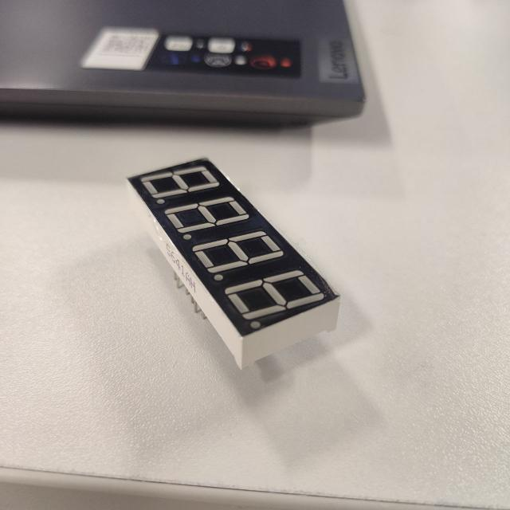
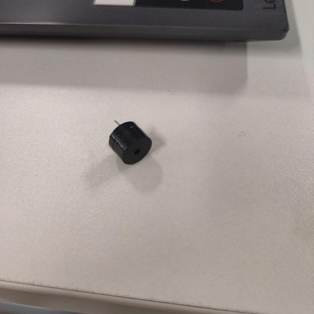
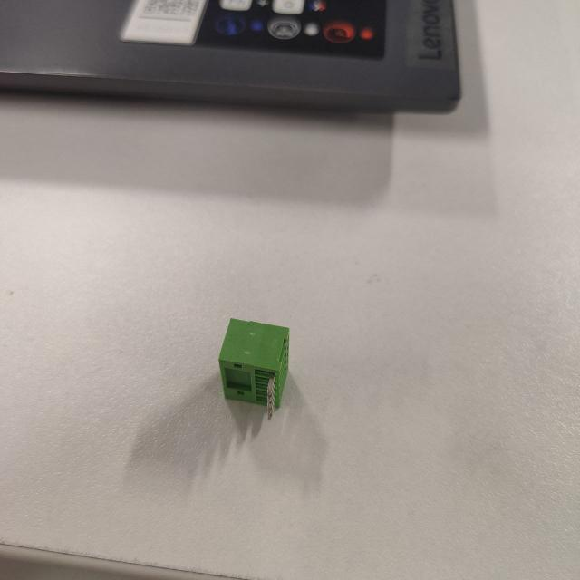
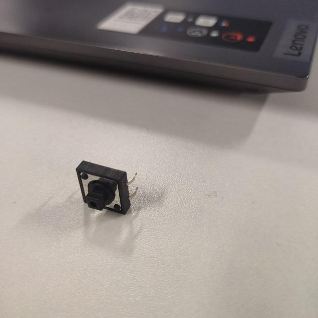
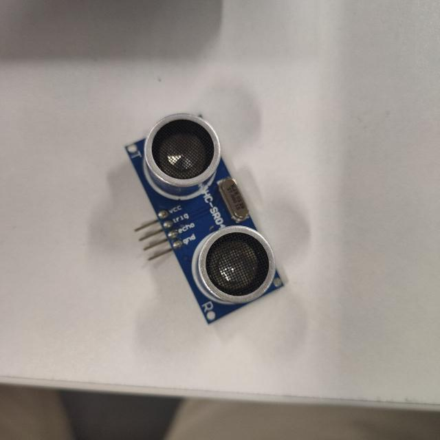
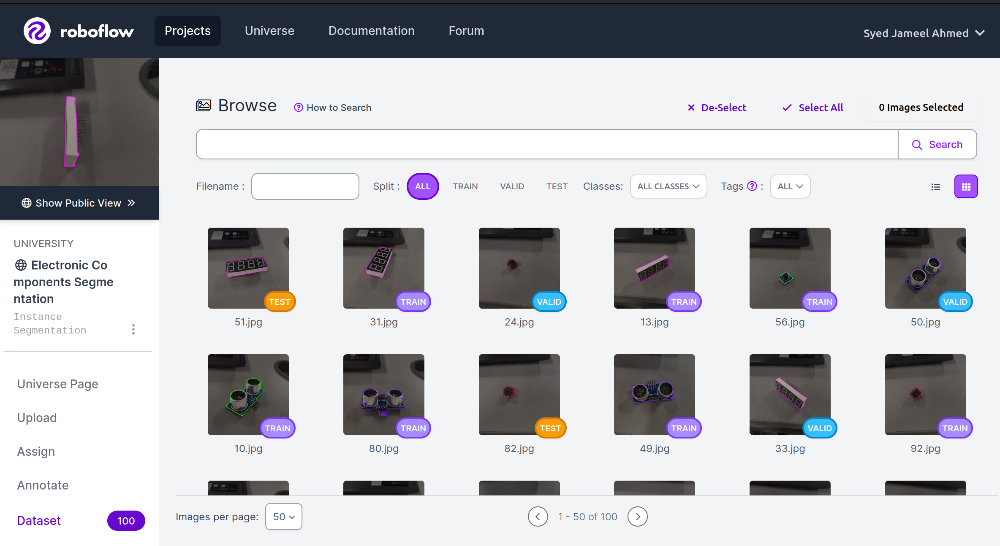
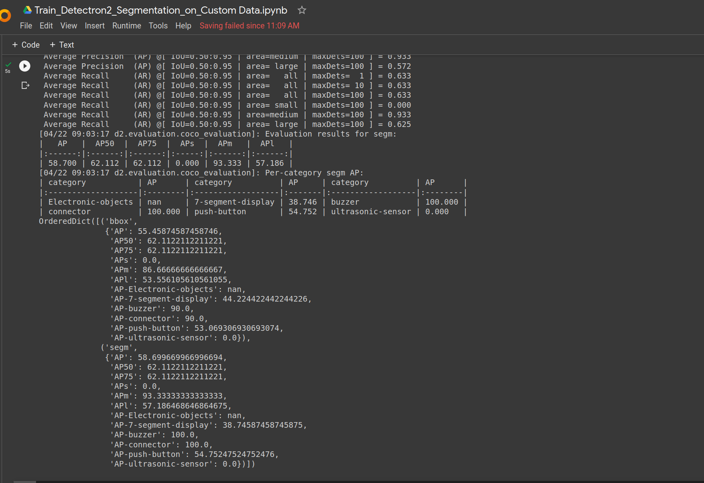
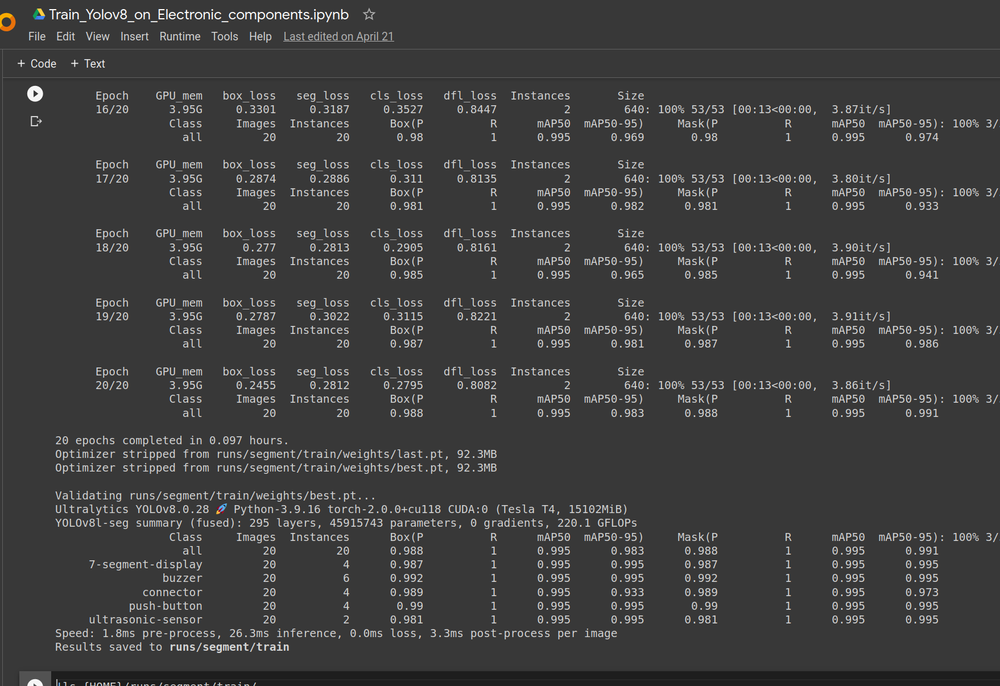
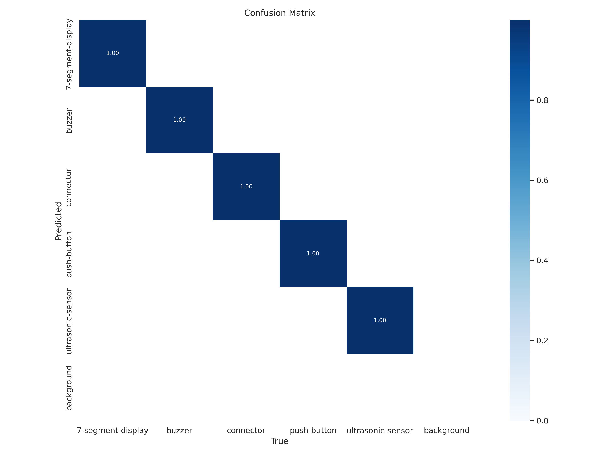
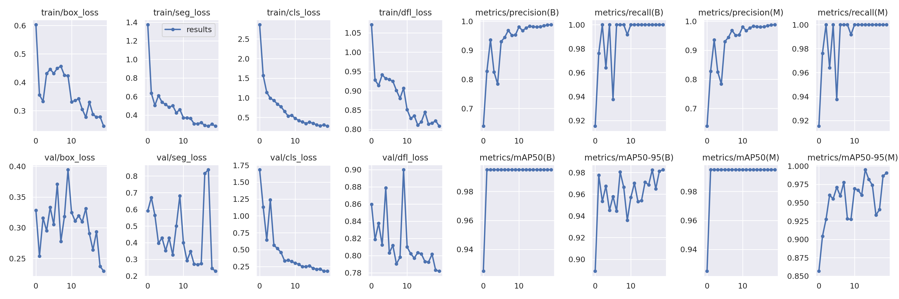

# Yolov8 and Detectron2 on Sample dataset

# Task: 
1. Take photos of your environment of two or more objects. (at least 100 instances between all objects) 

2. Annotate them on Roboflow for segmentation. 

3. Train a Mask RCNN model using detectron2

4. Train Yolov8  the smallest size for segmentation

5. Evaluate both models based on mAP and speed and size.

# 1. Take photos

5-Objects pictures were taken. 1. 7-segment-display, 2. buzzer, 3. connector, 4. push-button, 5. ultrasonic-sensor

7-segment-display image :

buzzer image:

connector image:

push-button image:

ultrasonic-sensor image:

# 2. Annotate them on Roboflow for segmentation.

# 3. Train a Mask RCNN model using detectron2

# 4. Train Yolov8  the smallest size for segmentation

- confusion matrix

- Losses

# 5. Evaluation
### Mean Average Precision (mAP)
- Yolov8: 99.5%
- Detectron2: 62.112%

### Training speed:
Yolov8 trained in ~6 minutes for 20 epochs even thought it is very light weight compared to detectron2 model 
Detectron2 trained in ~20 minutes

### Size:
- The Yolov8 model size: 92.3 Mb
- Detectron2 model size: 805.5 Mb

# References
1. https://roboflow.com/

# Train Yolov8 COLAB Link: [Yolov8](https://colab.research.google.com/drive/13H6rnO3aT0QXi7EgoBBDoX4ekV3oFfaR?usp=sharing)

# Train Detectron2 COLAB Link:[Detectron2](https://colab.research.google.com/drive/1MExbPGe4skrWXtkvHgl6eNaY4Tolm3L-?usp=sharing)